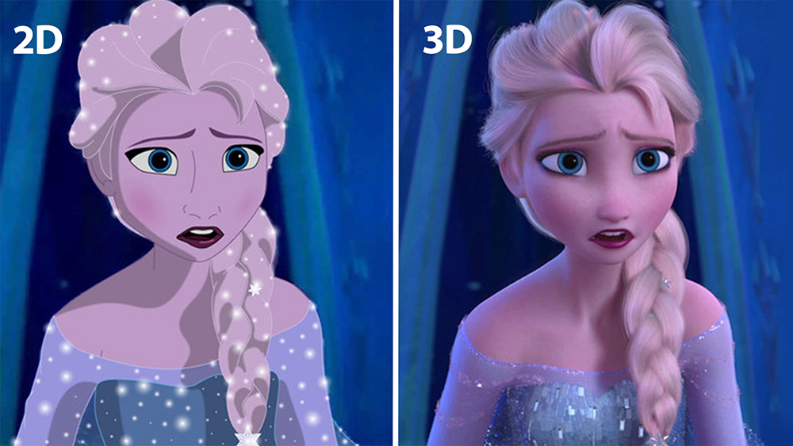

# L'animation 2D

## Qu'est-ce que l'animation 2D

### L’animation 2D se caractérise par la création d’objets et de personnages dans un espace bidimensionnel. Cela signifie qu’ils n’ont que de la largeur et de la hauteur. Il est considéré comme un style d’animation traditionnel, connu depuis les années 1800. Elle est largement utilisée dans la création de films d’animation, de dessins animés, de vidéos commerciales, de publicités, de présentations d’entreprise, de supports pédagogiques, de jeux vidéo, etc.

## L'évolution de l'animation 2D

### 1825, Invention du Thaumatrope par John Ayrton Paris

#### Le thaumatrope est un jouet optique qui exploite le phénomène de la persistance rétinienne. Lorsque la lumière atteint la rétine, les cellules photosensibles déclenchent une réaction chimique. La persistance d'une durée d'environ 50 ms laisse une "trace" au fond de la rétine. Si une autre image est perçue par l'œil dans ce laps de temps, notre cerveau aura l'illusion de voir les deux images en même temps. Peut-être fabriqués depuis le paléolithique, ces dispositifs seraient les plus anciens jouets d'optique au monde. Le principe est redécouvert et aurait été commercialisé pour la première fois en 1825 par John Ayrton Paris

### 1832, Invention du Phénakistoscope par Joseph Plateau

#### Il comporte un disque en carton, percé de dix à douze fentes, sur lequel un mouvement est décomposé en une séquence d'images fixes, et un manche permettant son maintien pendant sa rotation. Pour percevoir le mouvement, le spectateur se place en face d'un miroir et met ses yeux au niveau des fentes du disque, du côté opposé aux dessins. Il fait ensuite tourner le carton. Les fentes servent d'obturateur en ne laissant apparaître l'image reflétée dans le miroir qu'un très court instant. L'œil voit donc une seule image, qui semble être en mouvement lorsque le disque tourne à une vitesse suffisante. Le rendu des animations produites par le phénakistiscope a constitué, au moment de son invention et de sa découverte par le public, un formidable progrès. Il n'en demeure pas moins que ces animations comportent de nombreux défauts comme le manque de luminosité et le flou.

### 1834, Invention du Zootrope par William George Horner et Simon Stampfer

#### Le zootrope est un jouet optique inventé simultanément en 18341 par William George Horner et Simon Stampfer (en). Se fondant sur la persistance rétinienne et l'effet phi, le zootrope permet de donner l'illusion de mouvement d'un personnage dessiné. Un tambour percé de dix à douze fentes sur sa moitié supérieure abrite à l'intérieur une bande de dessins décomposant un mouvement cyclique. Le tambour est fixé sur un axe à sa base inférieure, ce qui permet de le faire tourner. On perçoit en boucle les mouvements des séquences animées en les regardant à travers les fentes pendant la rotation. La persistance rétinienne relie chaque dessin à l'autre, donnant l'illusion de la continuité, mais l'obturation provoquée par le passage des parties pleines du tambour provoque l'effacement de cette persistance rétinienne, qui permet la perception les unes après les autres des vignettes dessinées.

### 1868, Invention du Folioscope par John Barnes Linnett

#### Un folioscope est un petit livret de dessins ou de photographies qui représentent une scène en mouvement. Feuilleté rapidement, un folioscope procure à l'œil l'illusion que le sujet représenté est en mouvement. C'est une illusion optique provoquée par la persistance rétinienne et l'effet phi. Il fonctionne sur le principe très simple de l’effeuillage rapide avec le pouce d’une série empilée de vignettes dessinées dont la succession donne l’illusion d’un mouvement continu

### 1876, Invention du Praxinoscope par Émile Reynaud

#### Le praxinoscope fut inventé par Émile Reynaud en 1876 , il s'agissait d'un jouet optique donnant l'illusion du mouvement et fonctionnant sur le principe de la compensation optique. Ce jouet obtient une mention honorable à l'Exposition universelle de Paris de 1878 et aura un beau succès commercial qui permit à son inventeur de continuer ses recherches. Le praxinoscope améliore le zootrope de William George Horner dont il emprunte le principe de la bande de douze dessins décomposant un mouvement cyclique. Comme dans le zootrope, cette bande interchangeable est disposée à l'intérieur d'un tambour qui tourne autour d'un axe servant accessoirement de pied. Mais dans le praxinoscope, Émile Reynaud a ajouté à l'intérieur du tambour un cylindre à facettes sur lequel sont disposés douze petits miroirs.

### 1879, Invention du Zoopraxiscope par Eadweard Muybridge

#### Il reprend en 1879 le principe du disque tournant du Belge Joseph Plateau, le phénakistiscope (1832), qu’il améliore. Il remplace le carton qui constitue les disques, par du verre transparent sur lequel sont peintes ou collés des vignettes dessinées tirées des photographies.

### 1914, Invention de l'animation sur cello par Earl Hurd et John Randolph Bray

#### C'est une feuille transparente d'acétate de cellulose sur laquelle on peint à la main les éléments en mouvement d'un dessin animé effectué en animation traditionnelle. Grâce à la transparence de ces feuilles, on peut superposer plusieurs cellos et créer des scènes complexes sans devoir redessiner chaque fois les éléments statiques situés à l'arrière-plan. L'animation limitée est une technique de dessin animé qui, pour des raisons financières ou artistiques, réduit au minimum le nombre de mouvements des personnages, utilise peu de décors et use souvent d&#39;un nombre restreint d'images par seconde. L'économie qui en résulte provient également de la stylisation poussée des éléments dessinés, ceux-ci étant réduits à leur plus simple expression.

### 1915, Invention de la rotoscopie par Dave Fleischer et Max Fleischer

#### C'est une technique cinématographique qui consiste à relever image par image les contours d'une figure filmée en prise de vue réelle pour en transcrire la forme et les actions dans un film d'animation. Ce procédé permet de reproduire avec réalisme la dynamique des mouvements des sujets filmés

### 1942, Invention de l'animation limitée par Warner Bros.

#### L'animation limitée est une technique de dessin animé qui, pour des raisons financières ou artistiques, réduit au minimum le nombre de mouvements des personnages, utilise peu de décors et use souvent d'un nombre restreint d'images par seconde. L'économie qui en résulte provient également de la stylisation poussée des éléments dessinés, ceux-ci étant réduits à leur plus simple expression. Disney augmente les standards de l&#39;animation en faisant plus de recherche pour faire des personnages avec des émotions précise. Ils créent donc des chefs-d'oeuvre qui sont reconnus encore à ce jour.

### 1972, Invention de l’animation sur ordinateur par Edwin Catmull

#### Certaines animations par ordinateur sont intégrées au sein de prise de vues réelles ou d'animations obtenues par d&#39;autres procédés. C'est d'ailleurs comme ça que l'animation par ordinateur a commencé à être utilisée avant que des films ou des vidéos soient entièrement animés avec l'outil informatique.

## L'animation de nos jours

### Les étapes de l'animation 2D

#### La pré-production
##### Le processus de pré-production est la première étape de la création d’animations. Au cours de cette étape, l’équipe d’animation développe l’histoire et rédige le scénario de l’animation, conçoit les personnages, crée un storyboard, choisit les palettes de couleurs, prépare les arrière-plans et enregistre la voix off. Il s’agit d’une étape préparatoire au processus principal, qui doit donc être réalisée correctement.

#### La production
##### La production est le processus de création de l’animation en rassemblant tous les matériaux créés et en produisant les scènes. Ceci comprend la peinture des arrière-plans, la création des scènes individuelles et des activités des personnages, la réalisation de l’animation brute, le nettoyage de l’animation (traçage), le tweening, la coloration et la peinture des dessins à l’aide de logiciels informatiques, le compositing et l’exportation.

#### La post-production
##### La post-production est la phase de montage final de l’animation 2D. Au cours de cette étape, l’animation est enrichie d’effets sonores ou d’enregistrements supplémentaires qui renforcent son impact émotionnel. Une fois la version finale prête, elle est rendue et exportée vers différents formats.

## Comment choisir le bon logiciel ?

### Il y a une multitude de logiciel d'animation disponible mais sur le lien ci-dessous, un professionel vous présente une quinzaine de logiciels

#### https://www.youtube.com/watch?v=D9uYWykQmls
#### Code temporel de la vidéo

##### 00:00 - Aperçu des logiciels d'animation 2D
##### 00:47 - 01. ToonBoom Harmony
##### 01:20 - 02. Pencil2D
##### 01:34 - 03. Moho Pro
##### 02:01 - 04. Synfig
##### 02:42 - 05. Pencil
##### 03:11 - 06. Krita
##### 04:02 - 07. Adobe After Effects
##### 04:35 - 08. Plastic Animation Paper
##### 05:18 - 09. Opentoonz
##### 05:55 - 10. Powtoon
##### 06:20 - 11. FlipBook
##### 06:48 - 12. Cartoon Animator 4
##### 07:22 - 13. Adobe Animate CC
##### 08:56 - 14. Blender
##### 10:28 - 15. TVPaint Animation

